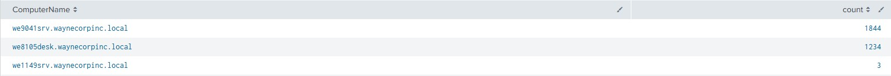
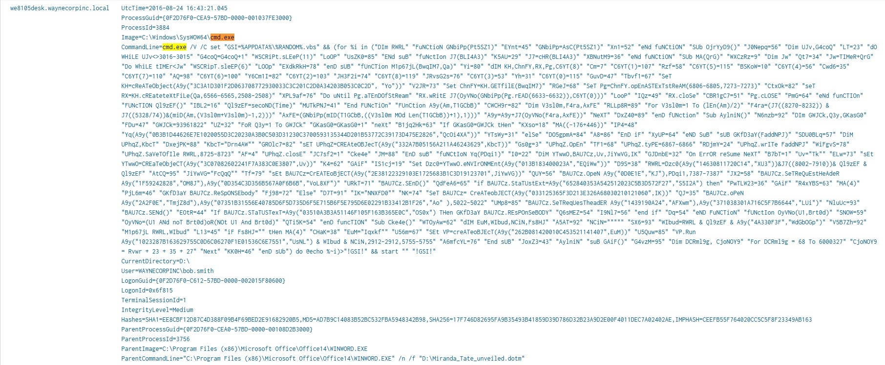
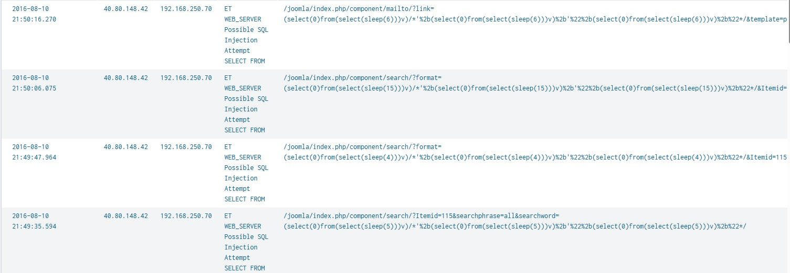

# Splunk SOC Detection Project

Built detections against the Splunk BOTS v1 dataset, mapped to MITRE ATT&CK techniques. Includes SPL queries, findings, and screenshots for each detection.

**Tools:** Splunk, Docker, SPL, MITRE ATT&CK
**Dataset:** [Splunk BOTS v1](https://github.com/splunk/botsv1)

---

## Detection 1: Privilege Escalation Volume by Host

**MITRE ATT&CK Mapping:** T1078 (Valid Accounts)

**Sourcetype:** `wineventlog:security`

**Query:**
```spl
index=botsv1 sourcetype=wineventlog:security EventCode=4672 | stats count by ComputerName | sort -count
```

**What it does:**
This query finds which hosts had the most "special privileges assigned" events (EventCode 4672). These events can indicate repetitive system-level and administrative logon attempts and activities. 

**Finding:**
Host `we9041srv.waynecorpinc.local` warrants further investigation and should be looked into as a potentially compromised or over-privileged system due to it having a much higher volume of privilege escalations compared to other hosts in the environment, with 1844 privilege escalation events.

**Screenshot:**



## Detection 2: Office Application Spawning Command Shell (Suspicious Parent-Child Process)

**MITRE ATT&CK Mapping:** T1566 (Phishing), T1059.005 (Command and Scripting Interpreter: VBScript), T1027 (Obfuscated Files or Information)

**Sourcetype:** `xmlwineventlog:microsoft-windows-sysmon/operational`

**Query:**
```spl
index=botsv1 sourcetype="xmlwineventlog:microsoft-windows-sysmon/operational" | spath | search "Event.System.EventID"=1 | eval combined=mvzip('Event.EventData.Data{@Name}', 'Event.EventData.Data', "=") | search combined="ParentImage=*winword.exe*" OR combined="ParentImage=*excel.exe*" OR combined="ParentImage=*iexplore.exe*" | table Event.System.Computer, combined
```

**What it does:**
This query finds events where Microsoft Word, Excel, or Internet Explorer spawn child processes. These applications have no reason to launch a command shell or script interpreter, which is a strong indicator of malicious exploit-driven code execution or macro execution.

**Finding:**
Found `WINWORD.EXE` opening a macro-enabled template (`Miranda_Tate_unveiled.dotm`). This template then spawned `cmd.exe` (suspicious behavior mentioned earlier), executing a heavily obfuscated VBScript payload written to `%APPDATA%`. This behavior, which is an initial-access and execution technique commonly used in phishing attacks, was clearly performing a malicious Office macro downloading and executing a secondary payload.

**Screenshot:**



## Detection 3: Time-Based Blind SQL Injection Attempt

**MITRE ATT&CK Mapping:** T1190 (Exploit Public-Facing Application)

**Sourcetype:** `suricata`

**Query:**
```spl
index=botsv1 sourcetype=suricata "alert.signature"="ET WEB_SERVER Possible SQL Injection Attempt SELECT FROM" | table _time, src_ip, dest_ip, "alert.signature", "http.url"
```

**What it does:**
Query finds Suricata alerts for SQL injection attempts against the web server. It shows the specific URL/parameter targeted, ng with the source and destination IPs.

**Finding:**
Identified an automated time-based blind SQL injection attack from `40.80.148.42` against a Joomla-based web application at ip address `192.168.250.70`. The attacker tests multiple URL parameters systematically (`catid`, `format`, `id`, `Itemid`, `searchphrase`, `searchword`) using `SLEEP()`-based injection payloads with varying delay values. From this technique, the attacker can infer that an injection was successful when there is no visible direct database output. The attacker's use of a rapid, systematic pattern across many parameters was consistent with automated SQL injection tooling (e.g., sqlmap) rather than manual testing, giving it away.

**Screenshot:**

